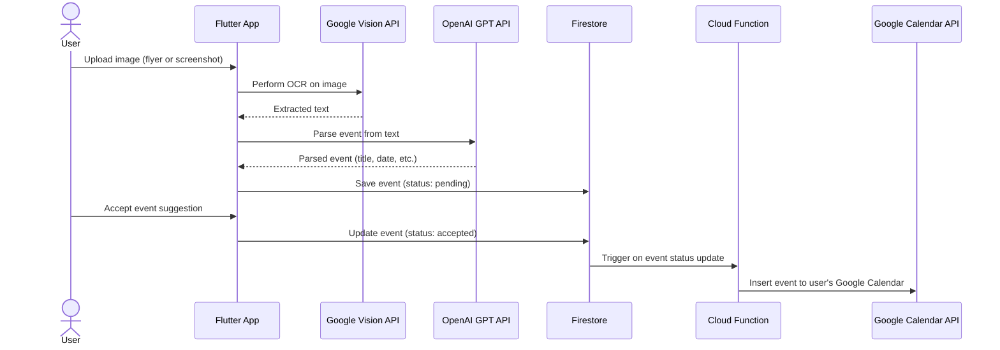
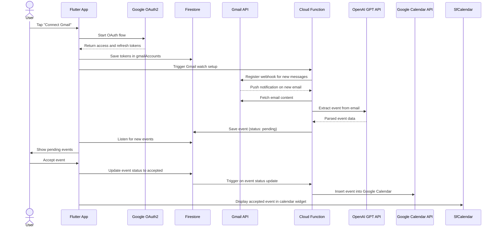

# 📅 CalendarIT

[](LICENSE)
[](https://flutter.dev)
[](https://firebase.google.com)

#### TUM CalendarIT is an AI-powered calendar assistant that helps you keep all your events and deadlines on track. It extracts events from your Gmail, uploaded images and notes, then lets you review and sync accepted ones directly to your Google Calendar — all through a clean, intuitive interface.
#### Originally developed for students at TUM, TUM CalendarIT is built with GPT-4o and Flutter Web and is designed to consolidate scattered event info into one easy-to-use timeline. It’s scalable and ready to help anyone stay organized.
---

## ✨ Features

- 🔗 **Gmail + Calendar Integration** – Connect your Google accounts and stay synced
- 🧠 **Email Parsing** – Auto-detect events from emails using GPT
- 📸 **Image to Event** – Upload a flyer or screenshot; we’ll extract the event with OCR + GPT
- 🔔 **Event Suggestions** – Review pending events before accepting or rejecting
- ✅ **One-tap Calendar Sync** – Accepted events are saved to your Google Calendar
- 💬 **Chatbot Assistant** – Chat naturally to create or extract events
- 🗓 **Weekly Calendar View** – See all your upcoming events at a glance

---
## 🛠️ Tech Stack

- **Frontend**: Flutter (Web, Android/iOS planned)
- **Backend**: Firebase (Auth, Firestore, Cloud Functions)
- **AI**: OpenAI GPT-4o
- **OCR**: Google Cloud Vision API
- **Calendar**: Google Calendar API

---

## 🏗️ Architecture Overview

````mermaid
flowchart TD
  subgraph User_Device
    A[Flutter App, Web and Mobile]
  end

  subgraph Firebase
    B[Firebase Auth]
    C[Firestore]
    D[Firebase Hosting]
  end

  subgraph Google_Cloud_Functions
    J1[Gmail Watch Setup]
    J2[Handle Gmail Push Event]
    J3[Extract Event using GPT]
    J4[Save Event to Firestore]
    J5[Add Event to Google Calendar]
    J6[Read Calendar Events]
  end

  subgraph Google_APIs
    E[Gmail API]
    F[Google Calendar API]
    G[Google OAuth2]
    H[Google Vision API]
  end

  subgraph External_AI
    I[OpenAI GPT API]
  end

  subgraph Web_Backend
    K[Web App Backend for GPT Chat]
  end

  A -->|Authenticate| B
  A -->|Hosted on| D
  A -->|Read and write data| C
  A -->|Upload image| H
  A -->|View and manage calendar| F
  A -->|Send chat input| K
  K -->|Call GPT API| I

  J1 -->|Subscribe via watch| E
  J1 -->|Authorized by| G
  E -->|Pushes new mail| J2
  J2 -->|Triggers parsing| J3
  J3 -->|Use GPT to parse| I
  J3 -->|Save extracted event| J4
  J4 -->|Write to| C
  J5 -->|Insert accepted event| F
  J5 -->|Authorized by| G
  J6 -->|Read calendar| F
  J6 -->|Authorized by| G
```` 
---

## 🚀 Getting Started

### 1. Prerequisites

- Flutter SDK
- Firebase CLI
- Google Cloud project with:
  - Gmail API enabled
  - Google Vision API enabled
  - Google Calendar API enabled
  - OAuth2 enabled


### 2. Setup

Create a `.env` file or define environment variables:

```
clientId = YOUR_CLIENT_ID
clientSecret = YOUR_CLIENT_SECRET
googleApiKey = YOUR_GOOGLE_API_KEY
openAiToken = YOUR_OPENAI_KEY
```

Make sure to securely load these in production.


### 3. Running Locally & Deployment

#### 🔧 Run the App Locally 

To install dependencies and start the app in Chrome:

```bash
flutter pub get
flutter run -d chrome
```

#### ✅ Deploy Cloud Functions

To deploy your backend Cloud Functions to Google Cloud:

```bash
firebase deploy --only functions
```

---

#### 🌐 Build & Deploy Flutter Web App

To build the Flutter web app:

```bash
flutter build web
```

If you're using **Firebase Hosting**, deploy the web build like this:

```bash
firebase deploy --only hosting
```

> **Note:** Make sure to run `flutter build web` before deploying to Firebase Hosting.

---

### 🔗 Live Demo

View the live demo here:  
[👉 Youtube](https://youtu.be/cm4lldDhmuM)


---
## 🛠️ Feature Workflows
### 📷 Image Upload Flow

1. User uploads an image (event flyer, screenshot).
2. The image is sent to Google Cloud Vision for OCR.
3. Extracted text is analyzed by GPT to structure event data.
4. A dialog lets the user confirm and accept the event.



---

### 📬 Monitoring Emails Flow

1. User connects their Gmail account via OAuth.
2. Gmail push notifications are configured using a Cloud Function.
3. When a new email arrives:
   - The Cloud Function is triggered.
   - GPT analyzes the email contents.
   - If an event is detected, it is saved to Firestore under `status: pending`.
4. The event appears in the Pending Events section of the UI.
5. The user can accept, reject or edit it.


---

### 💬 Chatbot Interaction Flow

1. User opens the AI Assistant chat interface.
2. The user types a request (e.g., "Schedule team meeting on Friday at 10 AM").
3. The message is sent to GPT for interpretation.
4. If an event is identified:
   - It's presented as a suggestion with parsed details.
   - The user can confirm or edit the suggestion.
5. Confirmed events are saved to Firestore and optionally synced to Google Calendar.

---

## 🙌 Contributing

Pull requests are welcome! For major changes, please open an issue first to discuss what you’d like to change.

---

## 📬 Contact

For questions or feedback, feel free to [open an issue](https://github.com/your-repo/issues) or contact us directly:

- Nathan Nozik — [nathan.nozik@tum.de](mailto:nathan.nozik@tum.de)
- Sergey Sarkisyan — [sergey.sarkisyan@tum.de](mailto:sergey.sarkisyan@tum.de)

---
## 🧑‍💻 Authors

- [Alexey Bednik](https://www.linkedin.com/in/bednik)
- [Klaudia Klara Paździerz](https://www.linkedin.com/in/klaudia-pa%C5%BAdzierz-6772922a7/)
- [Konstantin Pörschke](https://www.linkedin.com/in/konstantin-porschke/)
- Nathan Nozik
- [Sergey Sarkisyan](https://www.linkedin.com/in/sergey_sarkisyan)

## 📄 License

This project is licensed under the MIT License. See the [LICENSE](https://github.com/alexey192/calendarit/blob/master/LICENSE.txt) file for details.

---