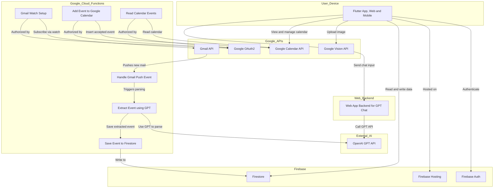

### High-Level System Architecture Diagram
### (C4 Model: Level 2 – Container Diagram)

```mermaid
flowchart TD
  subgraph User_Device
    A[Flutter App, Web and Mobile]
  end

  subgraph Firebase
    B[Firebase Auth]
    C[Firestore]
    D[Firebase Hosting]
  end

  subgraph Google_Cloud_Functions
    J1[Gmail Watch Setup]
    J2[Handle Gmail Push Event]
    J3[Extract Event using GPT]
    J4[Save Event to Firestore]
    J5[Add Event to Google Calendar]
    J6[Read Calendar Events]
  end

  subgraph Google_APIs
    E[Gmail API]
    F[Google Calendar API]
    G[Google OAuth2]
    H[Google Vision API]
  end

  subgraph External_AI
    I[OpenAI GPT API]
  end

  subgraph Web_Backend
    K[Web App Backend for GPT Chat]
  end

  A -->|Authenticate| B
  A -->|Hosted on| D
  A -->|Read and write data| C
  A -->|Upload image| H
  A -->|View and manage calendar| F
  A -->|Send chat input| K
  K -->|Call GPT API| I

  J1 -->|Subscribe via watch| E
  J1 -->|Authorized by| G
  E -->|Pushes new mail| J2
  J2 -->|Triggers parsing| J3
  J3 -->|Use GPT to parse| I
  J3 -->|Save extracted event| J4
  J4 -->|Write to| C
  J5 -->|Insert accepted event| F
  J5 -->|Authorized by| G
  J6 -->|Read calendar| F
  J6 -->|Authorized by| G
```