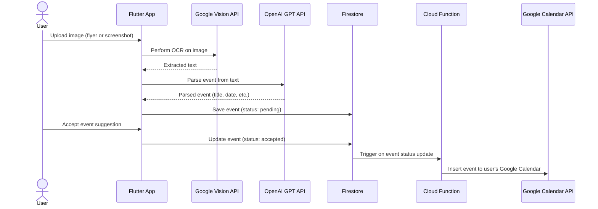

### Event Flow: Image to Event

```mermaid
sequenceDiagram
  actor User
  participant App as Flutter App
  participant VisionAPI as Google Vision API
  participant GPT as OpenAI GPT API
  participant Firestore
  participant CloudFunction as Cloud Function
  participant CalendarAPI as Google Calendar API

  User->>App: Upload image (flyer or screenshot)
  App->>VisionAPI: Perform OCR on image
  VisionAPI-->>App: Extracted text
  App->>GPT: Parse event from text
  GPT-->>App: Parsed event (title, date, etc.)
  App->>Firestore: Save event (status: pending)

  User->>App: Accept event suggestion
  App->>Firestore: Update event (status: accepted)
  Firestore->>CloudFunction: Trigger on event status update
  CloudFunction->>CalendarAPI: Insert event to user's Google Calendar
```