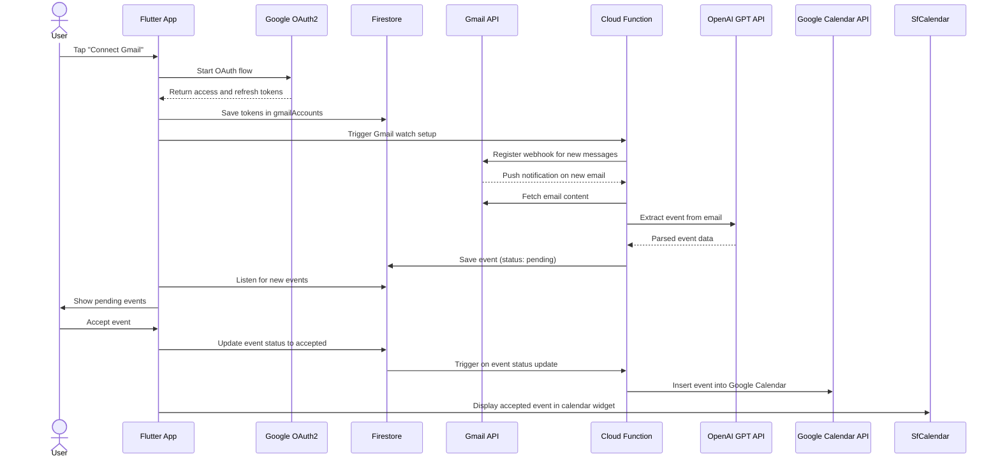

### Event Flow: Authorizing Gmail to Calendar

```mermaid
sequenceDiagram
  actor User
  participant App as Flutter App
  participant GoogleOAuth as Google OAuth2
  participant Firestore
  participant GmailAPI as Gmail API
  participant CloudFunction as Cloud Function
  participant GPT as OpenAI GPT API
  participant CalendarAPI as Google Calendar API
  participant CalendarView as SfCalendar

  User->>App: Tap "Connect Gmail"
  App->>GoogleOAuth: Start OAuth flow
  GoogleOAuth-->>App: Return access and refresh tokens
  App->>Firestore: Save tokens in gmailAccounts

  App->>CloudFunction: Trigger Gmail watch setup
  CloudFunction->>GmailAPI: Register webhook for new messages
  GmailAPI-->>CloudFunction: Push notification on new email

  CloudFunction->>GmailAPI: Fetch email content
  CloudFunction->>GPT: Extract event from email
  GPT-->>CloudFunction: Parsed event data
  CloudFunction->>Firestore: Save event (status: pending)

  App->>Firestore: Listen for new events
  App->>User: Show pending events

  User->>App: Accept event
  App->>Firestore: Update event status to accepted
  Firestore->>CloudFunction: Trigger on event status update
  CloudFunction->>CalendarAPI: Insert event into Google Calendar
  App->>CalendarView: Display accepted event in calendar widget
```